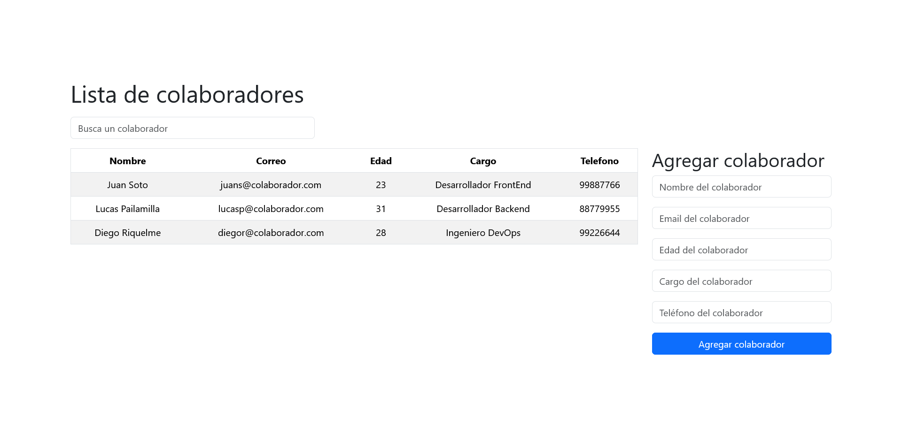
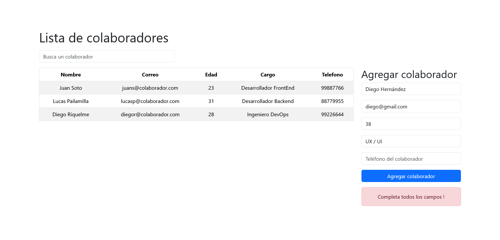
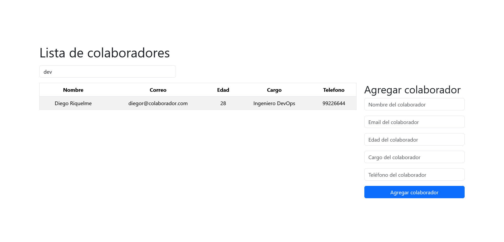

# Desafío 3 - Base de Datos de Colaboradores 📝

En este desafío, he aplicado los conceptos de renderización dinámica de componentes en React para desarrollar una aplicación que muestra un listado de colaboradores a partir de datos proporcionados. Además, la aplicación permite agregar nuevos colaboradores y filtrar la lista de resultados mediante una barra de búsqueda.

## Descripción del Desafío 🤓

El objetivo de este desafío era crear una aplicación en React que mostrara un listado dinámico de colaboradores a partir de unos datos iniciales proporcionados en un archivo JavaScript. La aplicación debía permitir agregar nuevos colaboradores, filtrar la lista de resultados mediante una barra de búsqueda y replicar el estilo utilizando Bootstrap.

## Capturas de Pantalla 🖼️

### Vista de la Aplicación


### Mensaje de Error


### Filtro de Búsqueda


## Requerimientos del Desafío 🎯

1. **Creación de al menos 4 componentes:** Se debían crear los componentes Listado, Formulario, Buscador y Alert, todos importados desde App.jsx.

2. **Cargar la lista de colaboradores desde un archivo JS:** Los datos iniciales de los colaboradores se importan desde un archivo JS.

3. **Mostrar la lista de colaboradores en un componente Listado:** La lista de colaboradores se muestra en un componente Listado utilizando una tabla de Bootstrap.

4. **Agregar colaboradores mediante un formulario:** El formulario debe contener los campos necesarios para agregar colaboradores a la lista y validar que no estén vacíos.

5. **Mostrar mensaje de Alerta después de agregar un colaborador:** Después de agregar un colaborador, el componente Alert debe mostrar un mensaje indicando si se agregó exitosamente o si los campos estaban vacíos.

6. **Crear un componente para realizar búsquedas:** Se debe crear un componente Buscador que permita buscar colaboradores por cualquier dato del formulario.

7. **Estilo de la Aplicación:** Se debe replicar el estilo de la aplicación utilizando Bootstrap, con un diseño responsive.

8. **Crear un repositorio en GitHub:** Se debe crear un repositorio en GitHub para alojar el proyecto y trabajar de manera colaborativa.

## Solución a Requerimientos 😉

### App.jsx
```jsx
import './App.css'
import React, { useState } from 'react'
import Listado from './components/Listado'
import Formulario from './components/Formulario'
import Buscador from './components/Buscador'
import Alert from './components/Alert'
import { BaseColaboradores } from './BaseColaboradores'

function App() {

  const [baseColaboradores, setBaseColaboradores] = useState(BaseColaboradores)
  const [alert, setAlert] = useState({ error: false, msj: "", color: "" })
  const [busqueda, setBusqueda] = useState("")

  const handleChange = (e) => {
    let value = e.target.value
    setBusqueda(value)
  }

  const colaboradoresFiltrados = baseColaboradores.filter((colaborador) => {
    if (
      colaborador.nombre.toLowerCase().includes(busqueda.toLowerCase()) ||
      colaborador.correo.toLowerCase().includes(busqueda.toLowerCase()) ||
      colaborador.edad.toLowerCase().includes(busqueda.toLowerCase()) ||
      colaborador.cargo.toLowerCase().includes(busqueda.toLowerCase()) ||
      colaborador.telefono.toLowerCase().includes(busqueda.toLowerCase())
    ) {
      return true
    }
    return false
  })

  return (
    <>
      <header>
        <div className="container">
          <div className="row">
            <h1 className="mb-0">Lista de colaboradores</h1>
            <Buscador baseColaboradores={baseColaboradores} setBaseColaboradores={setBaseColaboradores} busqueda={busqueda} setBusqueda={setBusqueda} handleChange={handleChange} />
          </div>
        </div>
      </header>
      <main>
        <div className="container">
          <div className="row">
            <div className="col-md-9">
              <Listado baseColaboradores={colaboradoresFiltrados} busqueda={busqueda} />
            </div>
            <div className="col-md-3">
              <Formulario baseColaboradores={baseColaboradores} setBaseColaboradores={setBaseColaboradores} setAlert={setAlert} alert={alert} />
              {alert.error && <Alert alert={alert} />}
            </div>
          </div>
        </div>
      </main>
    </>
  )
}

export default App
```

### App.jsx
```jsx
```

### Listado.jsx
```jsx
const Listado = ({ baseColaboradores }) => {
  return (
    <div className="listado-container">
      <table className="table table-striped text-center border">
        <thead>
          <tr>
            <th scope="col">Nombre</th>
            <th scope="col">Correo</th>
            <th scope="col">Edad</th>
            <th scope="col">Cargo</th>
            <th scope="col">Telefono</th>
          </tr>
        </thead>
        <tbody>
          {baseColaboradores.map(colaborador =>
          (
            <tr key={colaborador.id}>
              <td>{colaborador.nombre}</td>
              <td>{colaborador.correo}</td>
              <td>{colaborador.edad}</td>
              <td>{colaborador.cargo}</td>
              <td>{colaborador.telefono}</td>
            </tr>
          ))}
        </tbody>
      </table>
    </div>
  )
}

export default Listado
```

### Formulario.jsx
```jsx
const Formulario = ({ baseColaboradores, setBaseColaboradores, setAlert }) => {

  const [colaborador, setColaborador] = useState({ id: "", nombre: "", correo: "", edad: "", cargo: "", telefono: "" })

  const handleChange = (e) => {
    const { name, value } = e.target;
    setColaborador(prevColaborador => ({
      ...prevColaborador,
      [name]: value
    }));
  }

  const limpiarInputs = () => {
    setColaborador({ id: "", nombre: "", correo: "", edad: "", cargo: "", telefono: "" })
  }

  const enviarFormulario = (e) => {
    e.preventDefault()

    if (colaborador.nombre === "" || colaborador.correo === "" || colaborador.edad === "" || colaborador.cargo === "" || colaborador.telefono === "") {
      setAlert({ error: true, msj: "Completa todos los campos !", color: "danger" })
      return
    } else {
      setBaseColaboradores([...baseColaboradores, { id: Date.now(), nombre: colaborador.nombre, correo: colaborador.correo, edad: colaborador.edad, cargo: colaborador.cargo, telefono: colaborador.telefono }])
      setAlert({ error: true, msj: "Colaborador agregado !", color: "success" })
      limpiarInputs()
    }
  }

  return (
    <div className="formulario-container">
      <form onSubmit={enviarFormulario}>
        <h2>Agregar colaborador</h2>
        <div className="mb-3">
          <input type="text" className="form-control" name="nombre" placeholder="Nombre del colaborador" value={colaborador.nombre} onChange={handleChange} />
        </div>
        <div className="mb-3">
          <input type="text" className="form-control" name="correo" placeholder="Email del colaborador" value={colaborador.correo} onChange={handleChange} />
        </div>
        <div className="mb-3">
          <input type="text" className="form-control" name="edad" placeholder="Edad del colaborador" value={colaborador.edad} onChange={handleChange} />
        </div>
        <div className="mb-3">
          <input type="text" className="form-control" name="cargo" placeholder="Cargo del colaborador" value={colaborador.cargo} onChange={handleChange} />
        </div>
        <div className="mb-3">
          <input type="text" className="form-control" name="telefono" placeholder="Teléfono del colaborador" value={colaborador.telefono} onChange={handleChange} />
        </div>
        <button type="submit" className="btn btn-primary w-100">Agregar colaborador</button>
      </form>
    </div>
  )
}

export default Formulario
```

### Buscador.jsx
```jsx
const Buscador = ({ busqueda, handleChange }) => {
  return (
    <div className="buscador-container col-md-4 my-3">
      <input type="text" className="form-control" placeholder="Busca un colaborador" value={busqueda} onChange={handleChange} />
    </div>
  )
}

export default Buscador
```

### Alert.jsx
```jsx
const Alert = ({ alert }) => {
  return (
    <div className="alert-container mt-3 text-center">
      <div className={`alert alert-${alert.color}`} role="alert">
```

## Tecnologías Utilizadas 💻

- React
- CSS
- Bootstrap

## Estructura del Código 🧱

El código de la aplicación está estructurado utilizando React, con componentes individuales para el listado, el formulario, el buscador y la alerta. Se ha utilizado Bootstrap para replicar el diseño proporcionado y CSS para estilos adicionales.

## Mejoras Futuras 🚀

Para futuras iteraciones de la aplicación, se podría considerar agregar funcionalidades adicionales como edición y eliminación de colaboradores, paginación de resultados y validaciones más avanzadas en el formulario de registro.
